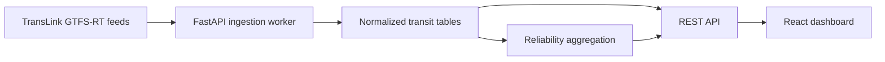

# Brisbane Smart Commute Dashboard

A resume-ready Software/Cloud portfolio project for Brisbane: a React + FastAPI dashboard that turns TransLink GTFS-Realtime data into live vehicle tracking, stop arrivals, service alerts and route reliability analytics.

The backend is configured for TransLink SEQ GTFS-Realtime feeds by default. The frontend still includes mock fallback data, so the project remains demoable if the API is offline or a feed request fails.

## Features

- Real-time-style route dashboard for Brisbane/SEQ bus, train and ferry services.
- Searchable route list with active vehicles, average delay and alert counts.
- Simplified live vehicle map with delay markers.
- Stop arrival cards and current service alerts.
- Seven-day route reliability chart backed by normalized historical data.
- FastAPI backend with live GTFS-RT parser, ingestion worker, local SQLite storage and cloud deployment config.
- CI workflow for frontend build and backend tests.

## Tech Stack

- Frontend: React, TypeScript, Vite, lucide-react
- Backend: FastAPI, Python, GTFS-Realtime bindings, SQLite for local demo
- Cloud target: Vercel for frontend, Render for backend
- Data source: TransLink SEQ GTFS-Realtime feeds

## Run Frontend

```bash
npm install
npm run dev
```

The app opens at `http://127.0.0.1:5173`.

## Run Backend

```bash
cd backend
python -m venv .venv
.\.venv\Scripts\Activate.ps1
pip install -r requirements.txt
uvicorn app.main:app --reload
```

The API opens at `http://127.0.0.1:8000`.

## Live Data

The default backend settings poll these public TransLink SEQ GTFS-RT feeds every 60 seconds:

- `https://gtfsrt.api.translink.com.au/api/realtime/SEQ/VehiclePositions`
- `https://gtfsrt.api.translink.com.au/api/realtime/SEQ/TripUpdates`
- `https://gtfsrt.api.translink.com.au/api/realtime/SEQ/Alerts`

TransLink publishes these as protobuf GTFS-Realtime feeds. No username/password is required.

## Environment

Copy `.env.example` if you want to override these values:

- `VITE_API_BASE_URL`
- `ENABLE_LIVE_INGESTION`
- `TRANSLINK_VEHICLE_POSITIONS_URL`
- `TRANSLINK_TRIP_UPDATES_URL`
- `TRANSLINK_SERVICE_ALERTS_URL`
- `INGESTION_INTERVAL_SECONDS`
- `CORS_ORIGINS`

## API Endpoints

- `GET /health`
- `GET /routes`
- `GET /routes/{route_id}/vehicles`
- `GET /stops/{stop_id}/arrivals`
- `GET /alerts`
- `GET /analytics/routes/{route_id}/reliability?from=&to=`
- `POST /admin/ingest`

## Architecture



## Tests

```bash
npm run build
python -m unittest discover -s backend/tests
```

## Resume Bullets

- Built a full-stack Brisbane transit analytics platform using React, TypeScript, FastAPI and GTFS-Realtime feeds.
- Designed a normalized ingestion pipeline for live vehicle positions, trip updates, service alerts and route reliability metrics.
- Implemented cloud-ready deployment config, CI checks, API health monitoring and mock fallback data for reliable demos.
- Created a user-facing dashboard with route search, live vehicle map, stop arrivals, alerts and seven-day reliability charts.
